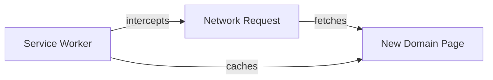

import { Callout, Steps, Step } from "nextra-theme-docs";

# Caching Mechanism

To handle cases where the ZFX PWA domain is blocked, we utilize the service worker to cache a page with a link to a new domain. This ensures that users can seamlessly continue using the app even if the current domain becomes inaccessible.

## Service Worker Caching

The service worker plays a crucial role in caching the page with the new domain link. Here's an overview of how it works:

<Steps>

### Step 1: Register the Service Worker

When the ZFX PWA is loaded, we register a service worker script that will handle the caching and retrieval of the new domain page.

### Step 2: Cache the New Domain Page

The service worker intercepts the network requests made by the PWA. When it detects a request for the new domain page, it caches the response using the Cache API.

### Step 3: Serve the Cached Page

When the current domain is blocked and the PWA fails to load, the service worker checks its cache for the new domain page. If found, it serves the cached page to the user instead of the blocked content.

</Steps>

## Cache Expiration and Updates

To ensure that users always have access to the latest version of the new domain page, we implement cache expiration and update mechanisms:

- Set a long cache expiration time: We configure the service worker to cache the new domain page with a long expiration time. This ensures that the cached page remains available even if the user doesn't access the PWA frequently.

- Periodically update the cached page: The service worker can periodically fetch the new domain page in the background and update the cached version if a newer one is available. This keeps the cached page up to date without requiring user intervention.

<Callout type="info">
The exact cache expiration time and update frequency can be adjusted based on the specific requirements and usage patterns of the ZFX PWA.
</Callout>

By leveraging the power of service workers and caching, we provide a seamless fallback mechanism for users to access the ZFX PWA through a new domain when the current one is blocked. This enhances the user experience and ensures uninterrupted access to the trading platform.

For more details on how the app handles domain blocking errors and redirects users to the new domain, refer to the [Error Handling](/domain-blocking-handling/error-handling) and [Redirecting to New Domain](/domain-blocking-handling/redirecting-to-new-domain) sections.