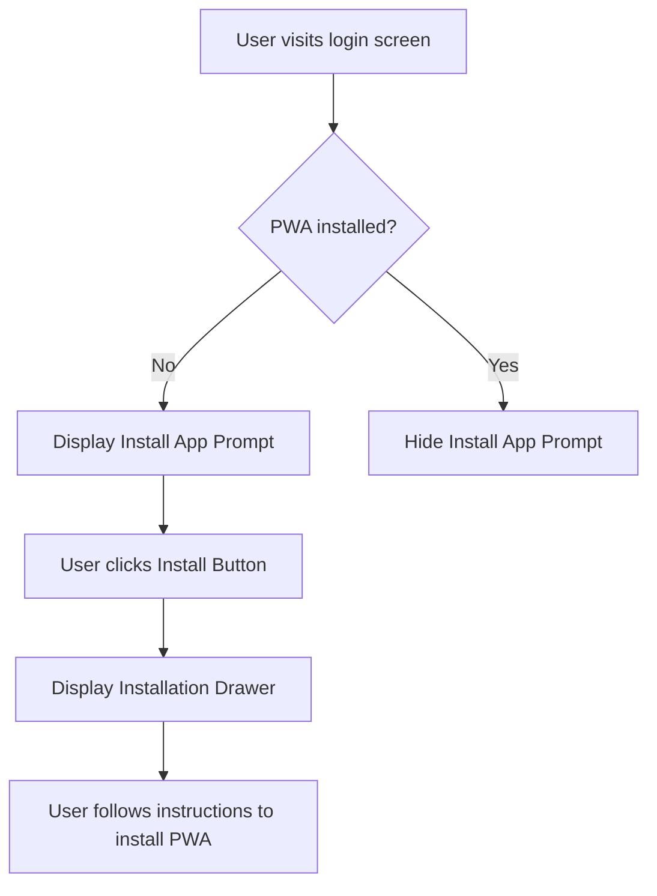

import { Callout, Steps, Step } from "nextra-theme-docs";

# Install App Prompt

The Install App Prompt is a feature that encourages users to add the ZFX PWA to their device's home screen for easy access and an app-like experience. This prompt is displayed at the top of the login screen and consists of a short message and an install button.

## Prompt Message

The prompt message should be concise and compelling, encouraging users to install the app. For example:

> "Install the ZFX app for a seamless trading experience!"

The message can be customized based on the user's language preference, which is determined by the [Language Switcher](/login-screen/language-switcher).

## Install Button

The install button should be prominently displayed next to the prompt message. When clicked, it should trigger the browser's native install prompt or display a drawer with step-by-step instructions on how to add the PWA to the home screen.

<Callout type="info">
The install button should only be displayed if the PWA has not been previously installed on the user's device. This can be determined by checking the `beforeinstallprompt` event in JavaScript.
</Callout>

## Installation Drawer

When the install button is clicked, a drawer should appear with instructions on how to add the PWA to the home screen. The instructions should be tailored to the user's device and browser.

<Steps>

### Step 1
Detect the user's device and browser using JavaScript.

### Step 2
Display the appropriate installation instructions based on the detected device and browser. For example:

- iOS Safari: "Tap the 'Share' button and select 'Add to Home Screen'"
- Android Chrome: "Tap the 'Menu' button and select 'Add to Home Screen'"

### Step 3
Provide visual cues, such as screenshots or animations, to guide the user through the installation process.

</Steps>

## User Flow

The following diagram illustrates the user flow for the Install App Prompt:

By implementing the Install App Prompt, you can significantly increase user engagement and retention by providing a seamless and easily accessible experience for your ZFX PWA users.