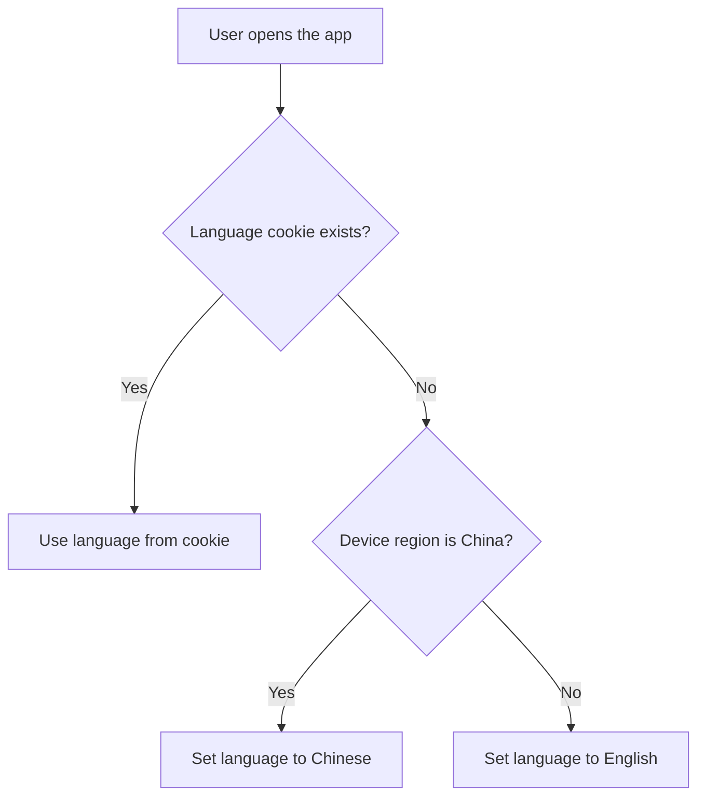

import { Callout, Steps, Step } from "nextra-theme-docs";

# Language Switcher

The language switcher is a crucial component of the login screen, allowing users to choose their preferred language for the ZFX trading PWA. By default, the app will attempt to detect the user's language based on the following logic:

1. If the user is coming from the main platform (my.zfx.com) and has a language cookie set, the app will use the language specified in the cookie.
2. If the user does not have a language cookie or the app cannot access it, the app will detect the user's device language based on the device region. If the region is China, the app will be displayed in Chinese. Otherwise, it will default to English.

## Language Switcher UI

The language switcher is located on the right side of the login screen, next to the title and subtitle. It is represented by a flag icon with a small dropdown arrow.

<Steps>
### Step 1

User clicks on the language switcher icon.

### Step 2

A drawer appears, displaying the available language options.

### Step 3

User selects their preferred language from the list.

### Step 4

The drawer closes, and the app's language is immediately updated to the selected language.
</Steps>

## Supported Languages

Initially, the ZFX trading PWA will support the following languages:

- English
- Simplified Chinese
- Traditional Chinese

In future releases, additional languages may be added, such as:

- Indonesian
- Thai
- Vietnamese
- Malay
- Korean
- Portuguese
- Spanish

<Callout type="info">
If the user's device language is not supported by the app, the language switcher will default to English.
</Callout>

## Implementation Details

The language switcher should be implemented using a combination of front-end and back-end technologies:

- Front-end: React components for the language switcher UI, state management for handling the selected language, and internationalization libraries (e.g., react-intl, i18next) for managing translations.
- Back-end: API endpoints for retrieving available languages and their corresponding translations, as well as storing the user's language preference.

### Language Detection Flow

By following this language detection flow and providing a user-friendly language switcher, the ZFX trading PWA ensures that users can easily navigate the app in their preferred language, enhancing their overall trading experience.

For more information on other aspects of the login screen, please refer to the following sections:

- [Install App Prompt](/login-screen/install-app-prompt)
- [Login Form](/login-screen/login-form)
- [Forgot Password Link](/login-screen/forgot-password-link)
- [Login Button](/login-screen/login-button)
- [Registration Link](/login-screen/registration-link)